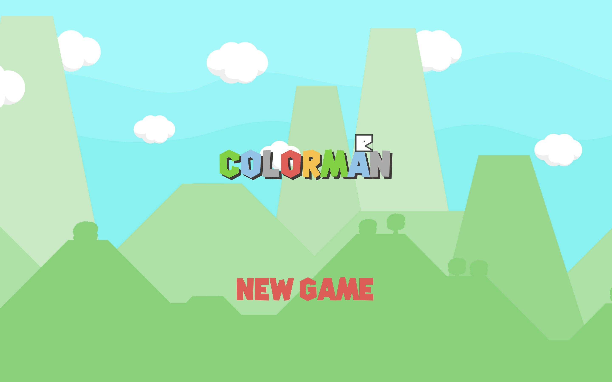

# COLORMAN: 2D Mobile Strategy Puzzle Game

Welcome to **COLORMAN** – a captivating 2D mobile strategy puzzle game that combines vibrant colors with strategic gameplay to deliver an engaging and challenging experience for players of all ages. Built using Unity 2D and C#, COLORMAN is available on both Android and iOS platforms.

## 📜 Table of Contents

1. [Overview](#overview)
2. [Gameplay](#gameplay)
3. [Features](#features)
4. [Installation](#installation)
5. [How to Play](#how-to-play)
6. [Contributing](#contributing)
7. [Acknowledgments](#acknowledgments)
8. [Contact](#contact)

## 🌈 Overview

COLORMAN is not just a game; it's an artistic adventure where you solve puzzles by strategically managing colors. The game challenges your problem-solving skills, creativity, and ability to think ahead. Launched in July 2020, COLORMAN continues to enchant players with its vibrant graphics and engaging gameplay.

## 🎮 Gameplay

In COLORMAN, you control a character who can manipulate colors in the environment. Your goal is to solve puzzles by strategically changing the colors of objects, navigating through various levels, and overcoming obstacles.

- **Objective**: Solve puzzles by changing the colors of different objects.
- **Controls**: Simple and intuitive touch controls.
- **Levels**: A variety of levels with increasing complexity and new challenges.

## ✨ Features

- **Colorful and Engaging Graphics**: Enjoy vibrant 2D visuals that make each level a joy to explore.
- **Strategic Puzzles**: Engage your mind with puzzles that require thoughtful color manipulation.
- **Cross-Platform**: Available on both Android and iOS devices.
- **Intuitive Controls**: Easy-to-use touch controls make the game accessible to all.

## 📲 Installation

### Android

1. Download the APK from [Google Drive](https://drive.google.com/file/d/YOUR_ANDROID_APK_LINK/view?usp=sharing).
2. Install the APK on your Android device.

### iOS

1. Download the IPA file from [Google Drive](https://drive.google.com/file/d/YOUR_IOS_IPA_LINK/view?usp=sharing).
2. Install the IPA on your iOS device using a tool like Cydia Impactor.

## 🎥 Gameplay Video

Experience the gameplay of COLORMAN by watching the video below:

    <iframe src="[https://drive.google.com/file/d/YOUR_VIDEO_ID/preview](https://drive.google.com/file/d/1-L_anGRmatW-LRrZUt9cs9iFpPZ1IgAN/view?usp=sharing)" width="640" height="480" allow="autoplay"></iframe>

## 🕹️ How to Play

1. **Start the Game**: Open COLORMAN on your device.
2. **Select a Level**: Choose a level to start your puzzle adventure.
3. **Manipulate Colors**: Use the touch controls to change the colors of objects and solve the puzzles.
4. **Complete the Level**: Successfully solve the puzzle to move to the next level.

## 🤝 Contributing

We welcome contributions to COLORMAN! Whether it’s reporting bugs, suggesting new features, or contributing code, your input helps make the game better. Please check out our [Contribution Guidelines](CONTRIBUTING.md) for more details.

## 🙏 Acknowledgments

Special thanks to all the players and contributors who have supported COLORMAN. Your feedback and suggestions are invaluable!

## 📧 Contact

For questions, feedback, or more information, please contact us at [your-email@example.com](mailto:your-email@example.com).

---

### Links

- [GitHub Repository](https://github.com/pirate-kiiiing/Colorman)

---

*Happy Coloring!*
